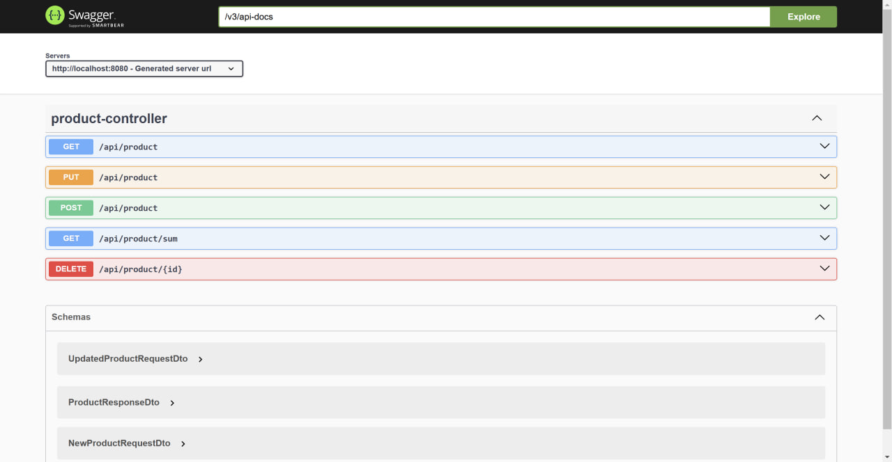

# Product API
### REST API for managing product entities

## Quick start

1. Clone (ensure Git is installed).
```shell
:: these scrips assume Windows as your OS
cd %USERPROFILE%/Desktop
git clone https://github.com/NadChel/product-api
```
2. Navigate to the project's root.
```shell
cd product-api
```
3. Run `docker-compose up` (ensure you have Docker running).
4. Open `localhost:8080/swagger-ui` in your web browser of choice.
5. Try endpoints from the UI.


*<small>Web interface</small>*

## Notes
* `GET api/product/sum`, by design, returns a response with no body in case none of persisted `product` records match passed-in values (as opposed to zero).
* Be sure to have the default ports (`8080`, `5432`) available – or else reconfigure them.